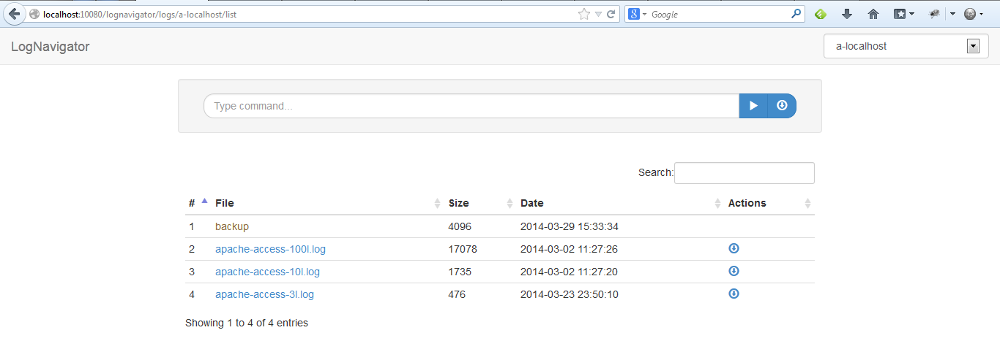
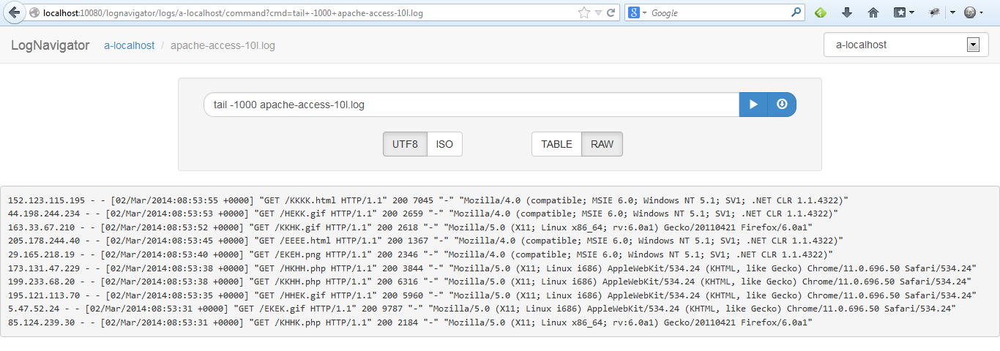

## LogNavigator

LogNavigator is a web application, made in java, which lets you browse your logs, wherever they are.

Key points :
* Navigate into your logs with the comfort of a web interface
* All your logs from different servers centralized in one entry point
- Configure log access from different sources : 
    - local directory
    - directory on a remote server (using SSH)
    - remote logs exposed by Apache Httpd DirectoryIndex (using HTTP)
* List logs, watch log content, filter log content, download log content
* Take advantage of powerful linux commands to get filtered log content
* Easily watch log content even if log file is archived in a `GZ` or `TAR.GZ` archive
* Optionally securise log access with user authentication and role-based authorization


## How to install it

- [Go to the last release](https://github.com/fbaligand/lognavigator/releases/latest) and download `WAR` file
- Deploy the `WAR` file on your favorite java app server (tomcat, jettty, glassfish, ...)
- Create a new file named `lognavigator.xml` at the root of your app server classpath
- Define your log access configurations inside `lognavigator.xml`. For example :
```xml
<?xml version="1.0" encoding="UTF-8"?>
<lognavigator-config>
    <log-access-config id="a-local-dir" type="LOCAL" directory="/path/to/logs" display-group="local-configs" />
    <log-access-config id="b-remote-dir-using-ssh" type="SSH" user="your-user" host="remote-host" directory="/path/to/logs" display-group="remote-configs" />
    <log-access-config id="c-remote-httpd-logs" type="HTTPD" url="http://archive.apache.org/dist/tomcat/" display-group="httpd-configs" />
</lognavigator-config>
```
- _Important note :_ if you define a `SSH` configuration, your local user hosting lognavigator server must have its ssh private key authorized to access remote host using remote user.
- Start your java app server
- That's all !


## How to use it 

- Once you have installed LogNavigator, open your favorite browser and go to :
[http://localhost:your-appserver-port/lognavigator/](http://localhost:your-appserver-port/lognavigator/)
- You see screenshot #1, the first log access configuration is selected in combobox at top right, and a table lists all log files and folders
- You can then change current log access configuration using combobox
- You can filter logs list using "Search" filter
- And finally you can of course click on a log file to watch its content
- You see screenshot #2
- By default, you see the 1000 last lines of the file (to avoid browser freeze due to too much content), using this command : `tail -1000 yourlog.log`
- You can then filter log content using powerful linux commands like `grep`
For example, type in `Command` field : `grep "GET" yourlog.log`
and click the `Execute` button
- You can finally download filtered content by clicking `Download` button


## Screenshots

**1. logs list**


**2. log content**



## Requirements

- Java SE 6+
- Java Server compatible with Servlet 3.0 (Tomcat 7 , Jetty 8, Glassfish 3, JBoss AS 6, ...)


## Behind the scene

Technologies behind LogNavigator :
- Twitter Bootstrap 3.1
- Datatables
- jQuery
- Spring MVC
- Spring Security
- sshj (for remote SSH connections)


## License

LogNavigator is released under version 2.0 of the [Apache License](http://www.apache.org/licenses/LICENSE-2.0).
